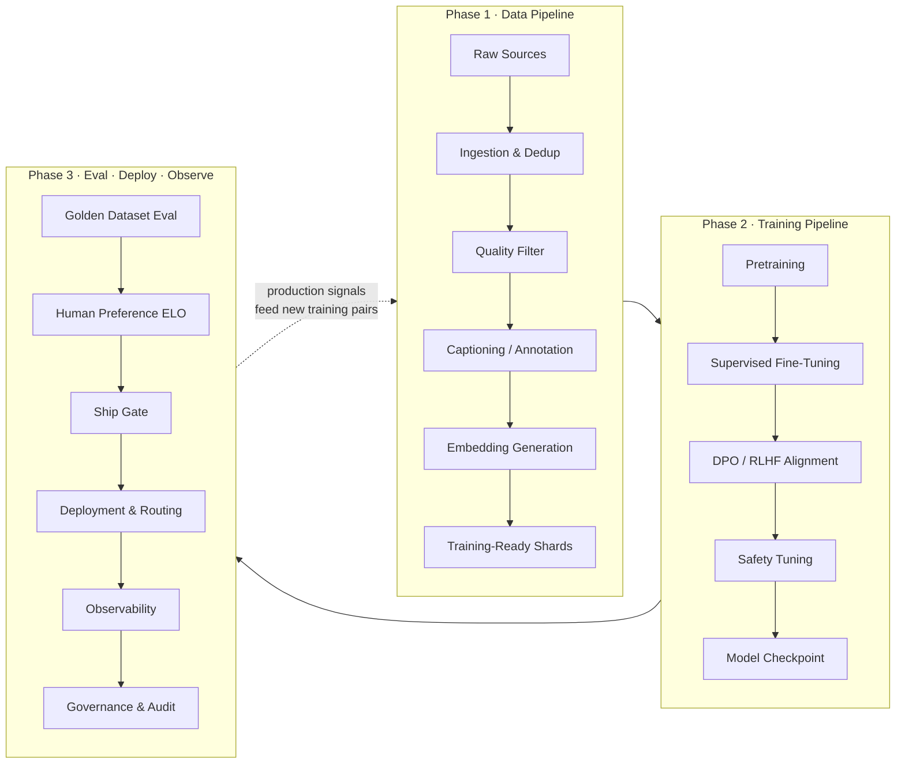
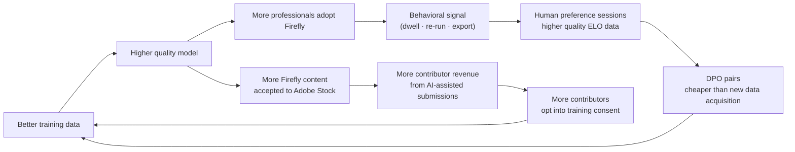

# Foundation Model Lifecycle
## Three Stages of LLM / Diffusion Model Development

> GitHub renders all diagrams below natively. Click any node label to cross-reference the deep-dive files.

---

## Overview — End-to-End Lifecycle

---

## Phase 1 — Data Pipeline
### How raw sources become training-ready embeddings

```mermaid
flowchart TD
    subgraph SRC["Source Buckets"]
        S1["Adobe Stock\n(Tier 1 consent)"]
        S2["Adobe Fonts\n(owned, IP-clean)"]
        S3["Behance Portfolios\n(public, T&C covered)"]
        S4["Pick-a-Pic v2\n851k human preference pairs"]
        S5["HPD v2\n798k preference annotations"]
        S6["Open Datasets\nLAION-Aesthetics · DataComp-1B"]
    end

    subgraph INGEST["Step 1 · Ingestion"]
        I1["Source registry\n(consent tier · license · freshness)"]
        I2["Pull & format normalize\n(JPG/PNG/WebP → standard)"]
    end

    subgraph DEDUP["Step 2 · Deduplication"]
        D1["Pass 1: Exact hash\n(MD5 — removes exact copies)"]
        D2["Pass 2: Semantic dedup\nCLIP embeddings + FAISS\ncosine sim > 0.95 → discard"]
    end

    subgraph FILTER["Step 3 · Quality Filtering"]
        F1["Resolution gate\n≥ 512×512 minimum"]
        F2["Aesthetic score\nLAION classifier ≥ 5.0\nTier 1: ≥ 7.5"]
        F3["Safety filter\nNSFW · watermark · blur"]
        F4["Aspect ratio bounds\n≤ 3:1 ratio"]
    end

    subgraph CAPTION["Step 4 · Captioning & Recaptioning"]
        CAP1["VLM structured captioning\nFlorence-2 (scale)\nClaude Vision (quality spot-check)"]
        CAP2["Fields: subject · spatial · lighting\nstyle · text-in-image · quality tags"]
        CAP3["Adobe Fonts: deterministic\nrender text → ground truth caption\n(automated, zero ongoing cost)"]
    end

    subgraph EMBED["Step 5 · Embedding Generation"]
        E1["CLIP ViT-L/14\n(text-image alignment · semantic search)"]
        E2["Aesthetic classifier score\n(quality tier assignment)"]
        E3["VAE latent encoding\nCACHED TO DISK\n(saves 15–25% training compute)"]
    end

    subgraph CONSTRUCT["Step 6 · Dataset Construction"]
        DC1["Aspect ratio bucketing\n1:1 · 2:3 · 3:2 · 16:9 bins\n(preserves composition)"]
        DC2["Curriculum mixing\nStage 1: breadth\nStage 2: quality ceiling\nStage 3: gap closure"]
        DC3["DPO pair assembly\nwinner + loser per prompt\n(Pick-a-Pic + HPD v2 + hard negatives)"]
    end

    subgraph FORMAT["Step 7 · Training-Ready Format"]
        TF1["WebDataset shards\n~1GB · ~1000–5000 samples each"]
        TF2["Shard manifest\n(version · source · consent tier · date)"]
        TF3["Streaming pipeline\nS3/GCS → torchdata → GPU\n(no full-dataset copy to disk)"]
    end

    subgraph FEEDBACK["Step 8 · Feedback Reinjection"]
        FB1["Human preference ELO\n→ DPO pairs → pipeline"]
        FB2["Hard negative mining\n(users re-ran prompt 3× → failure pairs)"]
        FB3["Synthetic augmentation\n(text rendering · anatomy · color)"]
    end

    SRC --> INGEST
    INGEST --> DEDUP
    DEDUP --> FILTER
    FILTER --> CAPTION
    CAPTION --> EMBED
    EMBED --> CONSTRUCT
    CONSTRUCT --> FORMAT
    FORMAT --> TRAINING[("Model Training\n/ Fine-Tune")]
    TRAINING --> FEEDBACK
    FEEDBACK --> CONSTRUCT
```

---

## Phase 2 — Training Pipeline
### Pretraining through alignment and safety tuning

```mermaid
flowchart TD
    subgraph DATA["Training Data Input"]
        TD1["WebDataset shards\n(Phase 1 output)"]
        TD2["DPO preference pairs\n(winner / loser per prompt)"]
        TD3["Safety red-team pairs\n(harmful prompt → refusal pairs)"]
    end

    subgraph PRETRAIN["Stage A · Pretraining"]
        PR1["Progressive resolution\n256px → 512px → 1024px → 4MP"]
        PR2["Broad knowledge\nLAION-Aesthetics · Stock general pool"]
        PR3["Mixed precision\nFP8 training · Flash Attention 3"]
        PR4["Checkpoint saved\n(base foundation model)"]
    end

    subgraph SFT["Stage B · Supervised Fine-Tuning"]
        SF1["Quality ceiling dataset\nStock Tier 1 · Behance · JourneyDB"]
        SF2["Capability-specific\ntext rendering pairs · editing pairs"]
        SF3["Instruction following\nInstructPix2Pix · MagicBrush"]
        SF4["LoRA adapters\n(r=64 for capability · r=16 for brand)"]
    end

    subgraph ALIGN["Stage C · Alignment — DPO"]
        AL1["Pick-a-Pic v2 + HPD v2\n1.6M human preference pairs"]
        AL2["DPO loss\nP(winner|prompt) ↑\nP(loser|prompt) ↓"]
        AL3["No reward model needed\n(single training run — more stable than RLHF)"]
        AL4["Preference rate improvement\ntarget: +30–50 ELO points"]
    end

    subgraph SAFETY["Stage D · Safety Tuning"]
        SA1["Safety classifier training\n(harmful content refusal)"]
        SA2["Red-team eval pairs\n(adversarial prompts → safe outputs)"]
        SA3["IP safety gate\nC2PA content credentials embedded"]
        SA4["EU AI Act documentation\n(training data provenance log)"]
    end

    subgraph CKPT["Checkpoint & Versioning"]
        CK1["Model checkpoint\n(weights · config · training hash)"]
        CK2["Dataset version tag\n(exact shard manifest used)"]
        CK3["Eval baseline snapshot\n(FID · CLIP · human pref rate)"]
    end

    DATA --> PRETRAIN
    PRETRAIN --> SFT
    SFT --> ALIGN
    ALIGN --> SAFETY
    SAFETY --> CKPT
    CKPT --> EVAL[["Phase 3: Evaluation"]]
```

---

## Phase 3 — Evaluation, Deployment, and Observability
### From golden datasets through production monitoring and governance

```mermaid
flowchart TD
    subgraph LAYER1["Layer 1 · Automated Eval (every build, minutes)"]
        L1A["FID — distribution quality"]
        L1B["CLIP Score — prompt alignment"]
        L1C["HPS v2 — automated preference score"]
        L1D["Blank Drop test — visual grounding check"]
        L1E["Image Sensitivity test — grounding reliability"]
        L1F["VBench — video: 16 temporal dimensions"]
    end

    subgraph LAYER2["Layer 2 · Pixel Math (every generation batch, sub-second)"]
        L2A["Color temperature variance"]
        L2B["Brightness · contrast · saturation"]
        L2C["Style consistency across batch\n(Feed Cohesion Score pattern)"]
        L2D["Cost: zero — deterministic, no model inference"]
    end

    subgraph LAYER3["Layer 3 · Human Preference ELO (before ship gate)"]
        L3A["Pairwise ranking sessions\nwinner vs. loser per prompt"]
        L3B["ELO score computed per segment\n(CC Pro · Express · GenStudio separate)"]
        L3C["Ship gate: ≥ 75% human preference rate\n(< 60% = coin flip — do not ship)"]
    end

    subgraph DEPLOY["Deployment & Routing"]
        DEP1["Segment routing\nExpress → distilled model\nCC Pro → foundation model\nEnterprise → foundation + LoRA"]
        DEP2["Flow matching\n4-step Express · 20-step CC Pro\n(inference latency ≤ 2s CC Pro)"]
        DEP3["KV-cache for multi-turn editing\n(30–40% latency reduction on Prompt to Edit)"]
        DEP4["Speculative decoding (video)\n50–70% latency reduction"]
    end

    subgraph OBS["Observability — Production Monitoring"]
        OB1["Behavioral signals\n(dwell · re-run · export · abandon)"]
        OB2["Repeat usage rate at 7 days\n(quality proxy — can't be gamed by volume)"]
        OB3["Post-generation editing time\n(CC Pro target: −30% vs. baseline)"]
        OB4["Arena ELO tracking\n(external benchmark per model release)"]
        OB5["Inference cost per segment\n(validates routing model financially)"]
    end

    subgraph GOV["Governance & Audit"]
        GOV1["C2PA content credentials\n(every Firefly output carries provenance)"]
        GOV2["Training data provenance log\n(EU AI Act documentation requirement)"]
        GOV3["Consent ledger\n(contributor opt-in status · revocation handling)"]
        GOV4["Enterprise data residency\n(no behavioral signal from enterprise accounts)"]
    end

    subgraph RETRAIN["Feedback → Retrain Trigger"]
        RT1["Preference rate drop > 3 pts\n→ research team brief with failing pairs"]
        RT2["Arena ELO regression\n→ identify capability gap · LoRA or full retrain decision"]
        RT3["Production behavioral signal\n→ hard negative mining → new DPO pairs"]
    end

    LAYER1 -->|"passes regression gate"| LAYER2
    LAYER2 -->|"passes consistency gate"| LAYER3
    LAYER3 -->|"≥ 75% preference rate"| DEPLOY
    LAYER3 -->|"< 75% → block"| RETRAIN
    DEPLOY --> OBS
    OBS --> GOV
    OBS --> RETRAIN
    RETRAIN -.->|"new training pairs\nfeed back to Phase 1"| DATA_PIPE[["Phase 1: Data Pipeline"]]
```

---

## The Feedback Loop — Why This Compounds

---

## Quick Reference — Key Metrics per Phase

| Phase | Metric | Target | Signal type |
|---|---|---|---|
| **Phase 1 — Data** | Dedup ratio after semantic pass | <30% near-duplicates in corpus | Data health |
| **Phase 1 — Data** | Caption semantic density score | Structured captions on top 5M images | Quality gate |
| **Phase 2 — Training** | DPO preference pairs ingested | 10k new pairs/month minimum | Flywheel health |
| **Phase 2 — Training** | Training compute per run | −20% vs. baseline (VAE caching + bucketing) | Cost efficiency |
| **Phase 3 — Eval** | Human preference rate (CC Pro) | ≥ 75% (ship gate) | Quality gate |
| **Phase 3 — Eval** | Arena ELO per release | Track vs. GPT Image 2, Midjourney, FLUX | Competitive |
| **Phase 3 — Deploy** | Generative Fill latency (CC Pro) | ≤ 2 seconds | Adoption threshold |
| **Phase 3 — Observe** | Repeat usage at 7 days | +20% in 6 months | Trust signal |
| **Phase 3 — Observe** | Preference → training brief cycle | ≤ 2 weeks | Loop velocity |

---

*Related files:*
- *[PHASE1_DATA_PIPELINE_DEEP_DIVE.md](PHASE1_DATA_PIPELINE_DEEP_DIVE.md) — Phase 1 data strategy, full detail*
- *[FIREFLY_DATA_PIPELINE_STRATEGY.md](FIREFLY_DATA_PIPELINE_STRATEGY.md) — Firefly Image 5 optimization + video extension*
- *[FOUNDATIONS_PM_WALKTHROUGH.md](FOUNDATIONS_PM_WALKTHROUGH.md) — Full product walkthrough*
