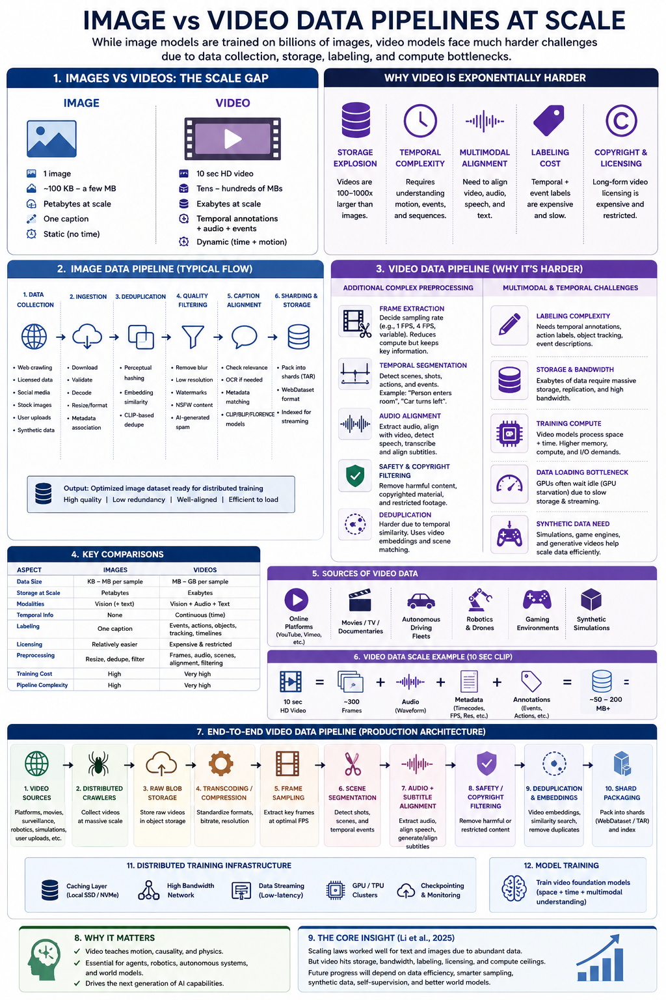

# Firefly Data Pipeline Strategy
## Optimization, Video Extension, and Compute Efficiency

**Author:** Bharat Namatherdhala
**Role:** Adobe Research & AI — Foundations PM
**Date:** May 2026
**Context:** Firefly Image 5 · Extends FOUNDATIONS_PM_WALKTHROUGH.md § 7

---

## TL;DR

1. **The data pipeline is the quality ceiling, not the model.** Firefly Image 5's −368 ELO gap to GPT Image 2 is not a model architecture problem — it is a data curation and feedback loop problem. The model can only be as good as what it was shown.

2. **Three bottlenecks to fix first.** Caption quality (low semantic density → weak prompt adherence), deduplication (near-duplicates inflate dataset size without adding signal), and missing high-resolution Stock data in the fine-tune pipeline. All three are solvable without a new model run.

3. **Video doesn't require a new pipeline — it requires temporal layers added to the image pipeline.** The image pipeline produces frame-level embeddings. Video adds a temporal consistency layer on top. Share 70–80% of infrastructure between the two.

4. **Compute cost at scale is solved by four levers, not one.** Progressive resolution training, cached VAE encodings, aspect ratio bucketing, and a distillation tier cut per-generation cost by an estimated 3–5× without quality regression at the Express segment threshold.

5. **Adobe's unique pipeline asset is untapped.** Adobe Fonts → text rendering LoRA. Behance portfolios → aesthetic ceiling. Adobe Stock Tier 1 consent program → quality flywheel. None of these require a new data acquisition deal. They require a data pipeline that actually connects them to training.

---

## 1. Current State — What the Image 5 Pipeline Is Actually Doing

Before optimizing, name the current state precisely.

### What Image 5 improved (from walkthrough context)
- **Native 4MP output** — Image 3/4 required post-hoc upscaling; Image 5 outputs at native resolution. This means training data must include high-resolution pairs — low-res training data becomes the bottleneck for this capability.
- **Improved text rendering** — still below 60% accuracy vs. Ideogram 3.0 at near-perfect text. Gap is real; improvement is partial.
- **Layered editing / Prompt to Edit** — instruction-following edits without masking. Requires instruction-based editing pairs in the training pipeline; the volume and quality of those pairs is the ceiling.
- **Improved human anatomy** — hands, faces, proportions. This is a training data distribution problem: the model was underexposed to high-quality anatomy-dense training examples.

### What the pipeline is likely missing (inferred from capability gaps)

| Gap | Root cause in the pipeline |
|---|---|
| Text rendering <60% | Text-rendering pairs not sufficient; Adobe Fonts not connected to training |
| Image editing not in top 5 | InstructPix2Pix/MagicBrush-equivalent pairs not at sufficient scale or quality |
| Aesthetic ELO 122 pts below Midjourney | No human preference feedback loop connected to training; DPO not running |
| Anatomy artifacts | Training data distribution skewed — not enough high-quality anatomy-dense examples |
| Prompt adherence gaps | Captions on training images are low semantic density — short alt-text, not structured descriptions |

---

## 2. Full Pipeline Architecture — Phase by Phase

```
RAW SOURCES
    │
    ▼
[Phase 1] INGESTION — pull from all source buckets
    │
    ▼
[Phase 2] DEDUPLICATION — near-duplicate removal at scale
    │
    ▼
[Phase 3] QUALITY FILTERING — aesthetic score + safety + resolution gates
    │
    ▼
[Phase 4] CAPTIONING / RECAPTIONING — structured semantic captions
    │
    ▼
[Phase 5] EMBEDDING GENERATION — CLIP + aesthetic + safety embeddings
    │
    ▼
[Phase 6] DATASET CONSTRUCTION — bucketing, mixing, curriculum design
    │
    ▼
[Phase 7] TRAINING-READY FORMAT — WebDataset shards, streaming
    │
    ▼
[Phase 8] FEEDBACK REINJECTION — behavioral + preference signals → new pairs
    │
    ▼
    MODEL TRAINING / FINE-TUNE
```

Each phase has its own optimization lever. Most quality gains come from Phases 3, 4, and 8 — not from raw data volume.

---

### Phase 1 — Ingestion

**Sources (from walkthrough § 7, prioritized by ROI):**

| Source | Data type | Volume | Priority | Status |
|---|---|---|---|---|
| Adobe Stock (Tier 1 opt-in consent) | High-quality creative images + metadata | ~500M+ images | P0 | Consent program exists; training pipeline unclear |
| Adobe Fonts library | Typography at every weight, size, style | Complete corpus | P0 | **Disconnected from training** — highest leverage move |
| Behance public portfolios | Professional creative work at quality ceiling | ~50M+ works | P1 | Not in training pipeline |
| Adobe Color | Validated human-rated color palettes | ~10M palettes | P1 | Underused as training signal |
| Adobe Express templates | Adobe-designed layouts (owned, IP-clean) | ~500k templates | P1 | Usable for instruction-following fine-tuning |
| Pick-a-Pic v2 (HuggingFace) | 851k human pairwise preferences | 851k pairs | P0 | Open; use for DPO |
| HPD v2 | 798k human preference annotations | 798k pairs | P0 | Open; use for DPO |
| LAION-Aesthetics v2 (score ≥ 6.25) | Aesthetic quality baseline | 600M pairs | P2 | Likely already in pipeline |
| MagicBrush | 10k human-annotated editing pairs | 10k pairs | P0 | Small but highest quality editing signal |
| InstructPix2Pix | 310k instruction editing pairs | 310k pairs | P1 | Synthetic; directly useful for editing fine-tune |
| JourneyDB | 4M Midjourney outputs + metadata | 4M pairs | P1 | Aesthetic quality signal at Midjourney level |

**What to do in Phase 1:**
- Build a source registry with consent tier, license type, and freshness date per source. Every dataset has a legal classification before it enters the pipeline.
- For Adobe Stock: implement Tier 1 contributor consent (top 1% by quality score, offered revenue share for AI training consent). This becomes the quality ceiling dataset.
- Adobe Fonts: create a text-rendering pair generator — render every font variant on structured text samples, paired with the text as ground truth. Automated. Near-zero ongoing cost.

---

### Phase 2 — Deduplication

Near-duplicate images are the single largest source of wasted compute in most training pipelines. If 30% of a 1B-image dataset is near-duplicate, training on it is equivalent to training on 700M unique images at 1.4× the cost.

**The problem at scale:** Pixel-level deduplication is computationally cheap but misses semantic duplicates. Embedding-space deduplication is accurate but requires computing embeddings first.

**Recommended approach — two-pass:**

```
Pass 1: Exact hash deduplication (MD5/SHA256)
  Cost: near zero · Removes: exact copies, format variants of same file
  
  ↓
  
Pass 2: Semantic deduplication via CLIP embedding clustering
  Cost: requires embedding generation first
  Threshold: cosine similarity > 0.95 → keep one, discard rest
  Tool: FAISS (Facebook AI Similarity Search) — handles billion-scale
  Removes: near-duplicates, same image different compression, minor crops
```

**Dataset impact on Firefly:** LAION-5B was found by the research community to contain ~40% near-duplicates after semantic dedup. Running this pass on the Firefly training corpus before the next model run is likely a free quality lift with zero additional data acquisition.

**For Adobe Stock:** Contributor submissions frequently include bracketed shots (same composition, minor exposure variation). These are near-duplicates. Deduplicate within contributor submissions before adding to training. This also reduces unfair contributor weighting.

---

### Phase 3 — Quality Filtering

Volume does not equal quality. The DALL-E 3 technical report and the SDXL paper both showed that training on a smaller, higher-quality subset outperforms training on raw scale. The key decisions in this phase are which filters to apply and in what order.

**Filter stack (in order of application — cheapest first):**

```
1. Resolution gate: discard images below 512×512
   Firefly Image 5 is 4MP native — minimum training resolution should reflect this

2. Aspect ratio bounds: discard extreme ratios (> 3:1 or < 1:3)
   Extreme aspect ratios waste context in attention computation

3. Aesthetic score gate: LAION aesthetic classifier ≥ 5.0 for general pool
   Top 1% Adobe Stock: aesthetic score ≥ 7.5 (quality ceiling tier)

4. NSFW / safety filter: run before any human review
   Adobe's existing safety classifiers — apply to all Bucket B open data

5. Watermark detection: discard or separate watermarked images
   Watermarks in training data cause watermark artifacts in generation

6. Blur / compression artifact detector: BRISQUE or NIQE score gate
   Reject images with severe compression artifacts — they teach the model to generate them

7. Text density filter: for editing and text rendering training sets, require images with visible text
   For general training, separate into text-heavy vs. text-light buckets for curriculum design
```

**For Image 5's 4MP native output:** Training data resolution must match output resolution. If the model was trained at 512px and outputs at 4MP via upscaling, the native output quality is architecturally limited. The Tier 1 Stock consent dataset and Behance portfolios are the sources for high-resolution training pairs. This is the key infrastructure investment for maintaining Image 5 quality and moving to 8MP.

---

### Phase 4 — Captioning and Recaptioning

**This is the highest-leverage single optimization in the entire pipeline.**

The DALL-E 3 technical report published this explicitly: replacing short alt-text captions with detailed, structured captions using GPT-4V improved prompt adherence more than any other single training change. Adobe can apply this methodology to its own Stock library using its own models.

**The problem with existing captions:**
Most image datasets have captions that look like: `"woman holding coffee cup"`. A structured recaption looks like: `"A woman in her mid-30s wearing a cream linen shirt holds a white ceramic coffee cup with both hands. Warm morning light enters from the upper left, casting soft shadows on the table surface. The background is a softly blurred kitchen in neutral tones. The mood is calm and domestic."` The second caption teaches the model to respond to descriptive, compositional prompts — which is what creative professionals actually write.

**Recaptioning pipeline:**

```
Source image
    │
    ▼
VLM (Florence-2 or Claude Vision — Adobe can use its own models)
    │
    ├── Subject description: what is depicted, who/what, count, attributes
    ├── Spatial relationships: where, relative positions, overlaps
    ├── Lighting: direction, quality, color temperature
    ├── Style: photographic/illustrative/graphic, color palette, mood
    ├── Text in image: transcribe visible text exactly (critical for text rendering)
    └── Quality tags: sharpness, composition, aesthetic rating
    │
    ▼
Structured caption (JSON schema → flattened to natural language for training)
```

**Cost:** Running a VLM on 500M Stock images is expensive. Run tiered: full recaptioning on Tier 1 quality-ceiling subset (top 5M images). Lightweight recaptioning (Florence-2, faster/cheaper) on next 100M. Existing captions for the remainder.

**Adobe Fonts — special captioning approach:**
Text rendering pairs don't need VLM captioning. The ground truth caption is the text itself. Pipeline: render text string in font → image. Caption: exact text + font attributes (weight, size, style, color). This is deterministic, automated, and covers Adobe's entire font library at essentially zero cost beyond compute.

---

### Phase 5 — Embedding Generation

Embeddings serve two purposes: retrieval during training (finding relevant pairs) and similarity computation for deduplication and quality filtering.

**Embed everything, cache aggressively:**

| Embedding type | Model | Use |
|---|---|---|
| CLIP ViT-L/14 | OpenCLIP | Text-image alignment scoring; semantic deduplication; dataset retrieval |
| Aesthetic score | LAION aesthetic classifier | Quality gate; dataset tiering |
| Safety score | Adobe safety classifier | Pre-filtering before any human review |
| VAE latent encoding | Firefly's own VAE | **Cache these — most expensive per-image compute** |

**The VAE caching optimization:** During training, each image must be encoded through the VAE (Variational Autoencoder) before entering the diffusion model. This encoding is deterministic — the same image always produces the same latent. At scale (500M images), encoding the same image on every epoch wastes enormous compute. Pre-encode and cache all VAE latents to disk. Training reads cached latents instead of re-encoding. This is a standard optimization that cuts training compute by 15–25% depending on dataset size.

**Implementation:** Store in WebDataset format alongside the image and caption. Each shard contains: `{image.jpg, image.txt (caption), image.npz (cached VAE latent), image.json (metadata)}`.

---

### Phase 6 — Dataset Construction: Bucketing, Mixing, Curriculum

**Aspect ratio bucketing:**
Training at fixed resolution (e.g., 1024×1024) requires cropping or padding non-square images. Both destroy information. Aspect ratio bucketing groups images into bins by native aspect ratio (portrait/landscape/square/ultrawide) and processes each bin at its native resolution. This preserves composition and eliminates the 15–20% content loss from forced cropping. SDXL adopted this approach and it is now standard.

```
Aspect ratio bins (examples):
  Square: 1:1 → train at 1024×1024
  Portrait: 2:3 → train at 832×1216
  Landscape: 3:2 → train at 1216×832
  Widescreen: 16:9 → train at 1344×768
  
Per-bin batch size is normalized so gradient updates are consistent across bins.
```

**Dataset mixing — curriculum design:**
Not all data is equally valuable at every stage of training. A curriculum should reflect this:

```
Stage 1 (early training — broad knowledge):
  Mix: 40% LAION-Aesthetics, 30% Adobe Stock general pool, 20% DataComp-1B, 10% specialty
  Purpose: general visual understanding at scale
  
Stage 2 (mid-training — quality lift):
  Mix: 60% Adobe Stock Tier 1 (quality ceiling), 20% Behance, 20% JourneyDB
  Purpose: aesthetic quality ceiling — the model learns what "great" looks like
  
Stage 3 (fine-tuning — gap closure):
  Mix: 50% editing pairs (MagicBrush + InstructPix2Pix), 30% DPO preference pairs, 20% text rendering
  Purpose: targeted capability gap closure — editing quality, text rendering, preference alignment
```

**Data mixing ratio management:** Track quality metrics (FID, CLIP Score, human preference rate) per mix ratio. Treat mixing ratios as hyperparameters with their own eval loop. A 10% shift in Stage 2 mix can produce measurable ELO movement.

---

### Phase 7 — Training-Ready Format

**WebDataset (tar shards) is the standard at scale:**
- Sequential disk access (no random seeks) → 10–20× faster I/O than individual file reads
- Streaming-compatible — no need to materialize the full dataset to disk before training
- Shard-level shuffle during training — shuffle shards, not individual samples
- Each shard: ~1GB, ~1000–5000 samples

**Streaming pipeline:**
```
Storage (S3/GCS/Azure Blob)
    → Streaming data loader (WebDataset + torchdata)
    → Per-GPU worker processes (parallel shard prefetch)
    → Batching by aspect ratio bucket
    → Training step
```

This eliminates the "copy dataset to local disk before training" step that costs hours on large clusters. Data streams directly from object storage to GPU memory.

**Shard management:**
- Version shards (shard_v2_tier1_aesthetic75_recaptioned.tar) — reproducible training runs
- Maintain a shard manifest with metadata (source, quality tier, recaption status, date)
- Decommission shards when consent is revoked (Stock contributor opt-out)

---

### Phase 8 — Feedback Reinjection

This is where the pipeline becomes a flywheel rather than a one-time build. Production signals feed back into the pipeline to generate new training pairs targeting specific failure modes.

**Three reinjection channels:**

**Channel A — Human preference DPO pairs:**
```
Human preference session (ELO pairwise rating)
    → Winner/loser pairs extracted per prompt
    → Filtered for prompt diversity (avoid over-representing popular prompts)
    → Added to DPO training set
    → Next fine-tune run targets the preference delta

Cycle time target: ≤ 2 weeks from session to training brief
Volume target: 10k new preference pairs per month (manageable, high signal)
```

**Channel B — Hard negative mining from production:**
```
Production generation log (aggregate, content-stripped)
    → Identify prompts where users ran generation > 3 times (negative signal)
    → Re-run those prompts with expanded seed range
    → VLM quality scoring on outputs → take best and worst
    → Best/worst = DPO pair targeting the exact failure mode users encountered
```

**Channel C — Synthetic augmentation for known gaps:**
```
Text rendering gap → render typography pairs from Adobe Fonts daily
Anatomy gap → curate high-quality anatomy-dense images from Stock → add to Stage 2 mix
Color accuracy gap → Adobe Color palettes → synthetic images with exact palette constraints
```

---

## 3. The Video Extension — Scaling from Image to Video with Shared Infrastructure

Video generation is not a separate pipeline. It is the image pipeline with temporal consistency layers added. This is where most of the 70–80% infrastructure sharing lives.

### What's the same between image and video pipelines

| Component | Image | Video | Shared? |
|---|---|---|---|
| Ingestion infrastructure | ✓ | ✓ | Yes |
| Deduplication (frame-level) | ✓ | ✓ | Yes — run on keyframes |
| Quality filtering | ✓ | ✓ | Yes — same aesthetic classifier on frames |
| CLIP embeddings | ✓ | ✓ | Yes — embed keyframes |
| VAE encoding | ✓ | ✓ | Yes — VAE is shared in most architectures (VideoLDM) |
| Safety filtering | ✓ | ✓ | Yes |
| WebDataset format | ✓ | ✓ | Yes — add frame sequences to shard structure |

### What's different — the temporal layers

**1. Video ingestion and frame extraction:**
```
Raw video source (mp4/mov)
    → Scene detection (PySceneDetect) — split on hard cuts
    → Per-scene: extract at consistent frame rate (e.g., 8fps for training)
    → Keyframe selection: sample representative frames for quality filtering
    → Store as frame sequences: {frame_001.jpg, frame_002.jpg, ... frame_N.jpg, clip.txt}
```

**2. Temporal consistency annotation:**
This is the most expensive new annotation step. Video training requires the model to learn that adjacent frames should be consistent.

| Annotation | What it measures | Tool |
|---|---|---|
| Optical flow | Per-pixel motion vectors between frames | RAFT or UniMatch (open source) |
| Camera motion | Pan/tilt/zoom vs. subject motion | Gyro metadata or optical flow decomposition |
| Subject consistency | Does the main subject look the same across frames | DINO features on subject crop |
| Temporal aesthetic score | Does quality degrade within a clip | Run LAION classifier on each frame; flag clips with high variance |

**3. Video captioning:**
Video captions must describe motion, not just content. Standard image captioning misses this entirely.

```
Video clip
    → Keyframe caption (same VLM as image pipeline)
    → Motion description: "camera slowly pulls back while subject walks left to right"
    → Temporal arc: "light transitions from golden hour to dusk across the clip"
    → Audio cue (if available): "ambient street sounds"
    
Tool: Florence-2 Video or LLaVA-Video (open weights) for batch processing
Cost reduction: caption every 4th frame, interpolate motion description
```

**4. Video-specific quality filters:**
```
Scene complexity score: filter out clips with too little motion (static shots are image data, not video data)
Flicker detection: discard clips with rapid unnatural brightness fluctuation
Temporal resolution gate: minimum 24 frames at 8fps = 3 seconds minimum clip length
Blur propagation: if >30% of frames fail the blur filter, discard the clip
```

### Video training data sources

| Source | Type | Volume | Priority |
|---|---|---|---|
| Adobe Stock Video (consent program) | Licensed, high quality | ~5M+ clips | P0 — same consent program as images |
| Frame.io public creative content | Professional video, platform T&Cs | ~1M+ clips | P1 |
| Pexels / Pixabay (CC0 license) | General-purpose video | ~100k clips | P2 |
| WebVid-10M (open research) | 10M video-caption pairs | 10M clips | P1 — open, widely used |
| HD-VILA-100M (Microsoft) | 100M high-resolution video clips | 100M clips | P2 — open research |
| Intern-VID (Shanghai AI Lab) | 7M high-quality video clips | 7M clips | P1 |
| Synthetically generated motion | Firefly → animate with open video model | Scaled | P2 — augmentation only |

**Video temporal benchmarks (regression metrics per build):**

| Metric | What it catches | Tool |
|---|---|---|
| VBench | 16 dimensions: motion smoothness, subject consistency, background stability, flicker | VBench (open source) |
| FVD (Fréchet Video Distance) | Distribution-level video quality | Open implementation |
| Subject consistency score | Does a person's face stay consistent across frames | DINO + cosine similarity per-clip |
| Motion smoothness | Unnatural jitter between frames | Optical flow variance |
| Temporal CLIP score | Does the clip stay semantically aligned to the prompt across all frames | CLIP per-frame + variance |

---

## 4. Compute Cost Reduction — The Four Levers

The compute cost problem is different for training vs. inference. Both require separate strategies.

### Training cost reduction

**Lever 1 — Progressive resolution training (3–4× training cost reduction)**
```
Stage 1: train at 256×256 — fast, cheap, broad visual understanding
Stage 2: fine-tune at 512×512 — quality mid-range
Stage 3: fine-tune at 1024×1024 — quality ceiling
Stage 4: fine-tune at 4MP (2048×2048) — Image 5 native resolution

Each stage starts from the previous stage's checkpoint.
Estimated savings: 3–4× vs. training at full resolution from scratch.
This is how PixArt-Sigma achieved 4K resolution training at low relative cost.
```

**Lever 2 — Cached VAE latents (15–25% training cost reduction)**
Pre-encode all training images through the VAE encoder once. Cache the latents. During training, load latents directly rather than re-encoding. For a 500M image dataset trained over multiple epochs, this eliminates the VAE encoding cost for epochs 2+.

```
Cost analysis:
  VAE encoding: ~0.5ms per image on A100
  500M images × 0.5ms = 70 GPU-hours
  10 training epochs × 70 GPU-hours = 700 GPU-hours saved
  At H100 spot pricing (~$2/hr): $1,400 savings per training run
  Annualized (monthly model updates): ~$16,800/year per model version
```

**Lever 3 — Mixed precision and Flash Attention**
- FP8 training (H100 native): 1.5–2× throughput improvement vs. BF16
- Flash Attention 3: 1.3–1.5× attention compute reduction; also enables longer sequence lengths (critical for 4MP generation where attention maps are large)
- Gradient checkpointing: trade 30% compute for 60% memory reduction — enables larger batch sizes per GPU

**Lever 4 — LoRA for capability gaps instead of full retraining (10–100× cost reduction)**

This is already in the walkthrough but bears quantifying per use case:

| Scenario | Full retrain cost (est.) | LoRA fine-tune cost (est.) | Savings |
|---|---|---|---|
| Text rendering gap closure | $2M–5M (months, full run) | $20k–50k (3–7 days, adapter) | 40–100× |
| Editing quality lift | $1M–3M | $15k–40k | 25–75× |
| Brand customization (per enterprise client) | Impossible (can't retrain per client) | $500–2k per adapter | Enables a business model |
| Aesthetic preference DPO | $500k–2M | $30k–80k (DPO is efficient) | 15–25× |

**LoRA architecture decision:** Use rank r=64 for significant capability lifts (text rendering, editing quality). Use r=16 for brand customization (style adherence, lower capacity needed). QLoRA when VRAM is the bottleneck — quantizes base model to 4-bit, trains adapter in fp16. 40% slower than full LoRA but 4× less memory.

### Inference cost reduction

**Segment-based model routing (already in walkthrough — cost quantified here):**

```
Express (consumer, mobile):
  Model: distilled model — 4-step flow matching
  Latency target: ≤ 5 seconds
  Compute: ~0.3× foundation model cost
  Quality bar: "good enough to post" — human preference ≥ 60%

CC Pro (Photoshop, Illustrator):
  Model: foundation model — 20-step flow matching
  Latency target: ≤ 2 seconds (professional adoption threshold)
  Compute: full foundation model cost
  Quality bar: human preference ≥ 75% (ship gate)

GenStudio Enterprise:
  Model: foundation model + LoRA adapter
  Latency target: ≤ 5 seconds (batch acceptable)
  Compute: foundation + adapter overhead (~5–10% additional)
  Quality bar: brand lock ≥ 90% compliance
```

**Speculative decoding for video (50–70% latency reduction):**
For video generation, each frame must be denoised through multiple diffusion steps. Speculative decoding drafts multiple frames in parallel using a smaller draft model, then verifies with the foundation model. Frames that pass verification are accepted without a full foundation model pass. Effective for temporally consistent sections (background, static elements).

**KV-cache for multi-turn editing:**
In Prompt to Edit (layered editing), the user issues multiple sequential editing instructions on the same image. The attention key-value pairs from the base image encoding can be cached across turns. Second and subsequent edits load the cached KV rather than re-encoding. 30–40% latency reduction for multi-turn workflows — directly benefits the CC Pro segment.

---

## 5. What's Needed — Infrastructure, Tooling, and Team

### Infrastructure requirements

| Component | Purpose | Tooling recommendation |
|---|---|---|
| Source data registry | Track all datasets with consent tier, license, freshness | Internal metadata store — simple Postgres or Airtable at PM level |
| Pipeline orchestration | Run phases 1–8 as DAG (directed acyclic graph) | Apache Airflow or Prefect — both handle large-scale data pipelines |
| Embedding store | Billion-scale nearest-neighbor search for deduplication and retrieval | FAISS (Facebook AI) or ScaNN (Google) — open source, runs on GPU |
| Dataset versioning | Reproducible training runs tied to exact dataset snapshot | DVC (Data Version Control) + S3 — open source |
| Streaming data loader | Training reads directly from object storage | WebDataset + torchdata — standard for large-scale diffusion training |
| Annotation platform | Human preference sessions (ELO pairwise rating) | Label Studio (open source) or Scale AI (if budget allows) |
| VLM captioning batch system | Recaption 5M+ Stock images with structured captions | Florence-2 (open, fast) for scale; Claude Vision for quality spot-check |
| Experiment tracking | Track dataset mix ratios, training runs, eval scores together | MLflow or W&B — connect dataset version to model version to eval result |

### Team gaps to address

| Gap | Needed role | Priority |
|---|---|---|
| Data pipeline engineering | Engineer who understands distributed data processing (Spark, Ray) | P0 |
| Annotation ops | Person who runs and QCs human preference sessions at scale | P0 |
| Data quality | Analyst who monitors pipeline health — deduplication rates, filter pass rates, caption quality | P1 |
| Video pipeline | Engineer with video processing experience (FFmpeg, temporal annotation) | P1 when video scale-up begins |
| Research liaison | PM counterpart to translate data gaps into training briefs for research team | This role — Foundations PM |

### The PM role in this pipeline

The Foundations PM is not running the pipeline. The PM is:
1. **Owning the dataset registry** — knowing what consent tier, what quality level, what license applies to every source. This is a legal risk management function, not just a data function.
2. **Translating eval signals into training briefs** — the feedback loop only works if someone converts "editing quality dropped 3 ELO points on instruction-following tasks" into a research team brief with specific failure pairs attached.
3. **Setting the mixing ratios and curriculum priorities** — which stage gets which data is a product decision, not a research decision. It determines which capabilities improve and in what order.
4. **Managing the consent program** — the Tier 1 Stock contributor program is a PM-owned initiative. The flywheel (better model → more Firefly content sold → more contributor revenue → more consent) requires PM coordination across Stock, Firefly, and contributor relations.

---

## 6. Scaling Strategy — 12-Month View

### Q3 2026 — Foundation (0–90 days)

| Initiative | Owner | Compute cost impact |
|---|---|---|
| Adobe Fonts → text rendering pair generator | Data eng + PM | Near zero — automated pipeline |
| VAE latent caching on current training corpus | ML eng | −20% training compute per run |
| Aspect ratio bucketing in training loader | ML eng | −15% wasted compute from forced cropping |
| Recaptioning top 5M Stock images (Florence-2) | Data eng | One-time cost; ongoing quality lift |
| Human preference ELO pipeline (Label Studio) | Annotation ops + PM | Enables DPO — prerequisite for aesthetic lift |
| Semantic deduplication pass on current corpus | Data eng | Dataset size reduction; compute savings scale with duplication rate |

### Q4 2026 — Quality Lift (90–180 days)

| Initiative | Owner | Expected quality impact |
|---|---|---|
| DPO fine-tune run on Pick-a-Pic v2 + HPD v2 | Research + PM (data brief) | +30–50 ELO points on aesthetic quality |
| LoRA adapter: text rendering (Adobe Fonts data) | Research + PM (data brief) | Text accuracy >70% |
| LoRA adapter: editing quality (MagicBrush + InstructPix2Pix) | Research + PM (data brief) | Editing arena top 5 entry |
| Behance ingestion + quality filtering | Data eng | Aesthetic ceiling dataset in pipeline |
| Progressive resolution training for next base model update | Research | Preserves 4MP quality at lower full-retrain cost |

### Q1–Q2 2027 — Video Scale-Up (180–365 days)

| Initiative | Owner | Notes |
|---|---|---|
| Video ingestion pipeline (Adobe Stock Video + Frame.io) | Data eng | Consent program extension to video contributors |
| Temporal annotation pipeline (optical flow + subject consistency) | Data eng | Open source tooling; one-time infrastructure build |
| Video captioning at scale (LLaVA-Video or equivalent) | Data eng | Batch processing; Florence-2 for speed |
| VBench regression metric on every video model build | ML eng | Gate before human eval |
| Video DPO pairs from Frame.io behavioral signals | Data eng + annotation ops | Same architecture as image preference loop |
| Speculative decoding for video inference | Research + infra | 50–70% video latency reduction |

---

## 7. The Flywheel — Why This Compounds

The data pipeline described above is not a one-time build. Every component connects to a feedback loop that makes the next iteration cheaper and better:

```
Better training data
    → Higher quality model
    → More creative professionals adopt Firefly
    → More behavioral signal (dwell, re-run, export)
    → More preference sessions (higher quality ELO data)
    → More DPO pairs (cheaper than acquiring new data)
    → Better fine-tune targeting specific failure modes
    → Higher quality model

Adobe Stock Tier 1:
    Better model
    → More Firefly-generated content accepted to Stock
    → More contributor revenue from AI-assisted submissions
    → More contributors opt into training consent
    → Better quality ceiling dataset
    → Better model
```

**The competitor moat this builds:**
Midjourney has aesthetic quality but no training data consent program, no workflow integration, and active litigation. GPT Image 2 has quality but no creative tool integration and no licensed data story. Neither can replicate the Adobe Fonts → text rendering pipeline, the Behance → aesthetic ceiling pipeline, or the Stock contributor consent flywheel. These are structural advantages that compound as the pipeline matures — not benchmarks that can be closed by training compute alone.

---

## 8. Image vs. Video Data Pipelines at Scale

The infographic below maps the structural gap between image and video training pipelines — why video is exponentially harder, where the compute and storage bottlenecks live, and what the full 12-step production video pipeline looks like.



### Key takeaways for the Firefly roadmap

| Dimension | Image | Video | PM implication |
|---|---|---|---|
| **Data size** | KB–MB per sample | MB–GB per sample (10s HD clip = 50–200 MB) | Video storage cost is 100–1000× image; budget accordingly |
| **Storage at scale** | Petabytes | Exabytes | Requires object storage tiering + streaming — no local disk strategy works |
| **Temporal info** | None | Continuous (time + motion) | New annotation pipeline required — optical flow, scene segmentation, event labels |
| **Labeling** | One caption | Events, actions, objects, tracking, timelines | 5–10× annotation cost per clip vs. per image |
| **Licensing** | Relatively easier | Expensive and restricted | Long-form video licensing is the biggest data acquisition blocker |
| **Training compute** | High | Very high (space + time dimensions) | Video models process space + time — higher memory, compute, I/O per step |
| **Pipeline complexity** | High | Very high | 12-step production pipeline vs. 6-step image pipeline |

**The 10-step video production pipeline** (from the infographic):
1. Video sources (platforms, surveillance, robotics, synthetic)
2. Distributed crawlers at massive scale
3. Raw blob storage in object storage
4. Transcoding and compression (standardize formats, bitrate, resolution)
5. Frame sampling (extract key frames at optimal FPS)
6. Scene segmentation (detect shots, scenes, temporal events)
7. Audio + subtitle alignment (extract, transcribe, align)
8. Safety and copyright filtering (remove harmful or restricted content)
9. Deduplication and embeddings (video embeddings, similarity search, remove duplicates)
10. Shard packaging (WebDataset / TAR and index for streaming)

**The core insight (Li et al., 2025):** Scaling laws worked for text and images because data was abundant. Video hits storage, bandwidth, labeling, licensing, and compute ceilings. Future progress depends on data efficiency, smarter sampling, synthetic data, self-supervision, and better world models — all of which are pipeline problems before they are model problems.

---

## 9. Research Reference Library — PM Strategy for Cost-Effective, High-Accuracy Foundation Models

23 high-cited papers organized by the decisions they inform. For each: the finding, the citation count, and what a PM should actually do with it.

---

### 9.1 Compute-Optimal Training — Sizing Runs Before You Spend

**[1] Training Compute-Optimal Large Language Models ("Chinchilla")**
*Hoffmann et al. · Google DeepMind · NeurIPS 2022 · ~5,000+ citations*

**Finding:** For a fixed compute budget, scale model size AND training tokens equally — roughly 20 tokens per parameter. Prior models (Gopher 280B) were massively undertrained. Chinchilla-70B on 1.4T tokens outperformed Gopher at 4× lower serving cost.

**PM decision it drives:** Before any training run, ask the research team: what is the Chinchilla-optimal token count for this model size? A model trained on fewer tokens than the optimal ratio is wasted compute. This is the single most important question to ask before signing off on a training budget.

---

**[2] Scalable Diffusion Models with Transformers (DiT)**
*Peebles & Xie · ICCV 2023 · ~2,000+ citations*

**Finding:** Replacing U-Net with a Transformer backbone in diffusion models unlocks predictable scaling laws — more compute = consistently lower FID. DiT is the architecture underlying FLUX, Stable Diffusion 3, and Sora.

**PM decision it drives:** Architectural choice is a multi-year roadmap commitment. DiT = predictable compute scaling = better capacity planning. If the team is still on U-Net, plan the migration path now — this affects every future training budget conversation.

---

### 9.2 Data Quality Over Quantity — The Curation Multiplier

**[3] LIMA: Less Is More for Alignment**
*Zhou, Liu et al. · Meta AI · NeurIPS 2023 · ~1,100+ citations*

**Finding:** Fine-tuning a 65B LLaMA model on 1,000 carefully curated prompt-response pairs matched performance of models trained on 52,000 RLHF samples. Knowledge comes from pretraining; alignment is shallow.

**PM decision it drives:** Do not buy or generate more fine-tuning data before exhausting quality improvements on existing data. 1,000 exceptional examples beat 50,000 mediocre ones. This cuts fine-tuning cycle cost and time by up to 50×.

---

**[4] Textbooks Are All You Need (phi-1)**
*Gunasekar et al. · Microsoft Research · arXiv 2023 / ICLR 2024*

**Finding:** A 1.3B model trained on ~7B "textbook quality" tokens (filtered + synthetically generated via GPT-3.5) hit 50.6% on HumanEval — competitive with models 10× larger trained on raw web data.

**PM decision it drives:** For domain-specific AI products (design tools, legal, medical), a small curated domain corpus outperforms a large general corpus. Data quality is a moat that can't be closed by a competitor's scale alone.

---

**[5] The FineWeb Datasets: Decanting the Web for the Finest Text Data at Scale**
*Penedo et al. · Hugging Face · arXiv 2024*

**Finding:** Models trained on FineWeb (15T carefully filtered tokens) consistently outperform those on much larger unfiltered corpora. FineWeb-Edu (1.3T educational tokens) shows 11-point MMLU gains — targeted domain filtering compounds at scale.

**PM decision it drives:** Data curation methodology is a competitive differentiator independent of compute scale. Budget for ongoing dataset curation as a platform capability, not a one-time project.

---

### 9.3 Fine-Tuning Efficiency — Capability Gaps at a Fraction of the Cost

**[6] LoRA: Low-Rank Adaptation of Large Language Models**
*Hu et al. · Microsoft · ICLR 2022 · ~10,000+ citations*

**Finding:** Injecting small trainable rank-decomposition matrices into frozen model weights reduces trainable parameters by 10,000× and GPU memory by 3× with no measurable quality loss on fine-tuning tasks.

**PM decision it drives:** Every enterprise customization feature on the roadmap (Custom Models, Brand Kit lock, Style ID) should assume LoRA-based infrastructure. Full retraining per customer is never the answer.

---

**[7] QLoRA: Efficient Finetuning of Quantized LLMs**
*Dettmers, Pagnoni et al. · University of Washington · NeurIPS 2023 · ~3,500+ citations*

**Finding:** 4-bit quantization + LoRA lets you fine-tune a 65B model on a single 48GB GPU — previously requiring multi-GPU clusters. Cost reduction: ~8× vs. standard fine-tuning.

**PM decision it drives:** QLoRA collapses the infrastructure barrier for fine-tuning. Validates offering fine-tuning as a self-serve product feature and sets expectations for customization service pricing margins.

---

**[8] Direct Preference Optimization (DPO)**
*Rafailov et al. · Stanford · NeurIPS 2023 · ~3,000+ citations*

**Finding:** DPO replaces the 3-step RLHF pipeline (collect preferences → train reward model → PPO) with a single supervised loss on preference pairs — matching or exceeding RLHF at a fraction of the complexity and compute.

**PM decision it drives:** DPO makes weekly preference-based fine-tuning experiments feasible instead of monthly. The feedback loop from human preference sessions to model improvement goes from months to days. This is the mechanism that closes Firefly's aesthetic ELO gap — budget for it explicitly.

---

### 9.4 Evaluation Methodology — Knowing When You Have a Good Model

**[9] VBench: Comprehensive Benchmark Suite for Video Generative Models**
*Huang et al. · NTU / S-Lab · CVPR 2024*

**Finding:** Decomposes video generation quality into 16 disentangled dimensions (temporal consistency, motion smoothness, subject identity, etc.), each validated against human preference. Replaces single-number FID/FVD that hides individual failure modes.

**PM decision it drives:** When the video team reports "we improved FVD by 5%," push back: which of the 16 dimensions? VBench dimensions map directly to user complaints (flickering, identity drift, motion blur). Use them to prioritize which quality issues to fix and to communicate progress to stakeholders in user-observable terms.

---

**[10] Chatbot Arena: An Open Platform for Evaluating LLMs by Human Preference**
*Chiang et al. · UC Berkeley / LMSYS · ICML 2024 · ~500+ citations*

**Finding:** Head-to-head human preference voting (ELO scoring) captures quality dimensions that automated benchmarks miss — user satisfaction, fluency, helpfulness in open-ended tasks. ELO rank directly correlates with user retention.

**PM decision it drives:** Require human preference wins (not just benchmark wins) as a ship gate for model releases. Treat external ELO arena rankings as a regression metric — not a vanity number. The Artificial Analysis image arena is the equivalent for Firefly; track it every release.

---

### 9.5 Synthetic Data — Using the Model to Improve the Model

**[11] Self-Play Fine-Tuning (SPIN)**
*Chen et al. · UCLA · ICML 2024 · ~200+ citations*

**Finding:** By playing a model against earlier versions of itself — generating synthetic training data from its own outputs — you can iteratively improve it without additional human-annotated data, converging toward GPT-4-level quality from weaker starting points.

**PM decision it drives:** Self-play is a cost-effective continuous improvement strategy between annotation cycles. Budget for it as a complement to, not a replacement for, human preference sessions.

---

**[12] Self-Improving Diffusion Models with Synthetic Data (SIMS)**
*Alemohammad et al. · arXiv 2024*

**Finding:** SIMS generates synthetic negative examples (low-quality images) to provide self-guidance for diffusion models — achieving record FID on CIFAR-10 and ImageNet without triggering model collapse.

**PM decision it drives:** For image/video generation, iterative self-improvement on synthetic data is now de-risked. Plan for post-launch quality improvement cycles that run in parallel with production without requiring new data collection rounds.

---

### 9.6 Caption Quality — The Single Highest-ROI Data Investment

**[13] Improving Image Generation with Better Captions (DALL-E 3)**
*Betker et al. · OpenAI · Technical Report 2023 · Widely cited as foundational*

**Finding:** Replacing short alt-text captions with detailed synthetic recaptions (generated by a specialized VLM) dramatically improved prompt following in DALL-E 3 — more than any architecture change. 95% of training images were recaptioned.

**PM decision it drives:** If the image model fails at complex prompts, fix the training data before the model. Recaptioning the top-quality training set is the highest-ROI data investment available. Budget for captioning pipeline infrastructure as a permanent platform capability — not a one-time project.

---

**[14] From Quantity to Quality: Boosting LLM Performance with Self-Guided Data Selection**
*Li et al. · NAACL 2024 · ~300+ citations*

**Finding:** Using the model to score and select the top 10% of instruction-tuning data achieves better performance than training on the full dataset — with 89% less training data volume.

**PM decision it drives:** Run data quality scoring before committing compute to a fine-tuning run. The model can identify its own high-quality training signal. This changes the pipeline: filter first, train second — reduces wasted GPU cycles by up to 10×.

---

### 9.7 Diffusion Model Efficiency — Latency as a Product Feature

**[15] Consistency Models**
*Song, Dhariwal, Chen, Sutskever · OpenAI · ICML 2023 · ~1,000+ citations*

**Finding:** Consistency models generate images in 1–4 steps by learning to map any point on a diffusion trajectory directly to the clean output — eliminating the 50–1000 step inference that makes diffusion slow. 10–50× latency reduction with modest quality tradeoffs.

**PM decision it drives:** Inference speed is a product metric tied directly to user experience and cost-per-generation. Consistency distillation is the architecture behind the Express distilled model tier. Target: 4-step generation for consumer, 20-step for CC Pro.

---

**[16] High-Resolution Image Synthesis with Latent Diffusion Models (Stable Diffusion)**
*Rombach, Blattmann et al. · LMU Munich · CVPR 2022 · ~8,000+ citations*

**Finding:** Moving diffusion from pixel space to a compressed latent space reduces compute by orders of magnitude (256× for a 512×512 image) while maintaining quality — making high-resolution consumer generation feasible.

**PM decision it drives:** Latent diffusion is the architecture that enables the 2-second latency threshold for CC Pro. VAE latent caching (pre-encode training images) is a direct consequence — it cuts training compute 15–25% by eliminating per-epoch re-encoding.

---

### 9.8 Video Generation — Training Architecture and Data Strategy

**[17] Stable Video Diffusion: Scaling Latent Video Diffusion Models to Large Datasets**
*Blattmann, Dockhorn et al. · Stability AI · ICLR 2025 · ~500+ citations*

**Finding:** Successful video model training requires three distinct stages: (1) text-to-image pretraining, (2) video pretraining on a large noisy corpus, (3) high-quality video fine-tuning on a small curated set. Skipping or collapsing stages causes quality collapse.

**PM decision it drives:** Video AI is not an extension of image AI — it requires a separate, multi-stage roadmap with its own data pipeline, compute budget, and quality gates. Budget all three stages independently. Shortcutting Stage 2 or 3 is a known failure mode.

---

**[18] Video Generation Models as World Simulators (Sora)**
*OpenAI Research · Technical Report 2024 · ~600+ citations*

**Finding:** Joint image+video training on diverse aspect ratios and durations using a single DiT architecture outperforms separate specialized models. Prompt recaptioning via GPT-4 improved temporal coherence. Conclusion: video generation at scale is a path to world simulation.

**PM decision it drives:** A unified image+video model strategy (shared architecture, shared pipeline) is superior to a portfolio of specialized models. This informs the infrastructure consolidation roadmap — build shared rather than parallel.

---

### 9.9 Safety and Alignment — Non-Negotiable Roadmap Items

**[19] Training Language Models to Follow Instructions with Human Feedback (InstructGPT)**
*Ouyang et al. · OpenAI · NeurIPS 2022 · ~10,000+ citations*

**Finding:** RLHF with 13,000 human-labeled examples aligned GPT-3 (175B) so effectively that human raters preferred the 1.3B InstructGPT output over raw GPT-3 175B. Alignment quality, not model scale, drives user preference.

**PM decision it drives:** Every model-based product needs an alignment stage — it is not optional and it matters more to users than model size. Justify ongoing annotation budget using this result. A 7B well-aligned model will outperform a 70B unaligned model on user satisfaction metrics.

---

**[20] Tree-Ring Watermarks: Fingerprints for Diffusion Images that are Invisible and Robust**
*Wen, Kirchenbauer et al. · University of Maryland · NeurIPS 2023 · ~200+ citations*

**Finding:** Embedding a pattern in the initial noise vector (Fourier space) of diffusion sampling creates an invisible watermark that survives crops, rotations, and JPEG compression — without any post-hoc image modification. Detection is done by inverting the diffusion process.

**PM decision it drives:** EU AI Act and White House AI commitments mandate provenance marking for AI-generated content. Tree-Ring watermarking is technically superior to pixel-level methods and is directly implementable in diffusion pipelines. Add to safety roadmap alongside C2PA for compliance coverage.

---

**[21] SafeGen: Mitigating Unsafe Content Generation in Text-to-Image Models**
*Li et al. · ACM CCS 2024 · ~100+ citations*

**Finding:** Removing unsafe visual representations from model attention layers in a text-agnostic manner means adversarial prompts cannot trigger harmful outputs — because the visual capability itself has been removed, not just filtered at output.

**PM decision it drives:** Prompt-level safety filters are insufficient — adversarial users routinely bypass them. Model-level safety (removing capabilities during training) is the robust, defensible product strategy. Shift the roadmap from "filter outputs" to "remove capability at the model layer."

---

### 9.10 Multimodal Training — The Architecture for Multi-Modality Products

**[22] Visual Instruction Tuning (LLaVA)**
*Liu, Li, Wu, Lee · UW-Madison / Microsoft · NeurIPS 2023 Oral · ~3,000+ citations*

**Finding:** Using a text-only GPT-4 to generate multimodal instruction-following data (image + text Q&A), then fine-tuning a vision-language model on this synthetic data, produced open-source performance at 85.1% of GPT-4V — from a tiny fine-tuning dataset.

**PM decision it drives:** You can bootstrap high-quality multimodal capabilities using synthetic instruction data generated cheaply from a text LLM — no expensive multimodal annotation pipeline required. This is the architecture template for any multimodal product feature (image understanding, layout comprehension, visual editing Q&A).

---

**[23] OneLLM: One Framework to Align All Modalities with Language**
*Han et al. · CVPR 2024 · ~200+ citations*

**Finding:** A single universal encoder + projection layer architecture can align image, audio, video, depth, IMU, and point cloud data into one LLM — rather than separate specialized models per modality.

**PM decision it drives:** A unified multimodal model is significantly more cost-efficient to maintain than a portfolio of single-modality models. This validates a platform architecture strategy over a model-per-modality strategy — relevant for the Firefly + Premiere + After Effects unified model roadmap.

---

### Research Priority Summary for Foundations PM

| Decision | Paper(s) to cite | Implication |
|---|---|---|
| Training run sizing | Chinchilla [1] | Ask: are we Chinchilla-optimal before signing off on compute |
| Data pipeline investment | DALL-E 3 [13], LIMA [3], FineWeb [5] | Quality curation > raw scale every time |
| Fine-tuning strategy | LoRA [6], DPO [8] | LoRA for capability gaps; DPO to close the ELO gap |
| Ship gate methodology | Chatbot Arena [10], VBench [9] | Human preference ELO as the gate; automated metrics as regression only |
| Video roadmap structure | SVD [17], Sora [18] | 3-stage pipeline; unified image+video architecture |
| Synthetic data cycles | SIMS [12], SPIN [11] | Post-launch improvement without new annotation budget |
| Safety roadmap | InstructGPT [19], Tree-Ring [20], SafeGen [21] | Alignment first; model-layer safety over output filters |
| Multimodal features | LLaVA [22] | Synthetic instruction data bootstraps multimodal quality cheaply |
| Inference cost reduction | Consistency Models [15], Latent Diffusion [16] | Distillation tier for Express; latent caching for training |

---

*Bharat Namatherdhala · May 2026*
*Extends: FOUNDATIONS_PM_WALKTHROUGH.md § 7 (Data Strategy)*
*Related: AI_ML_PIPELINE_LIFECYCLE.md · PHASE1_DATA_PIPELINE_DEEP_DIVE.md*
